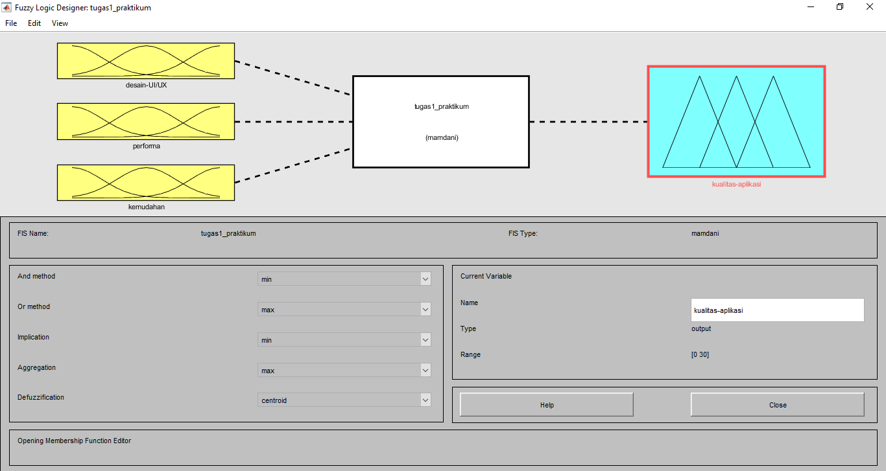
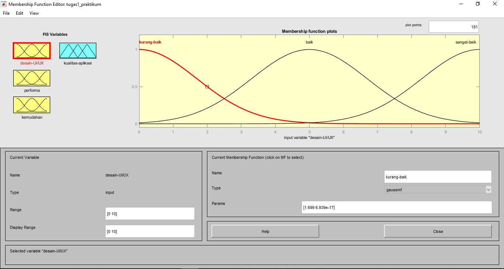
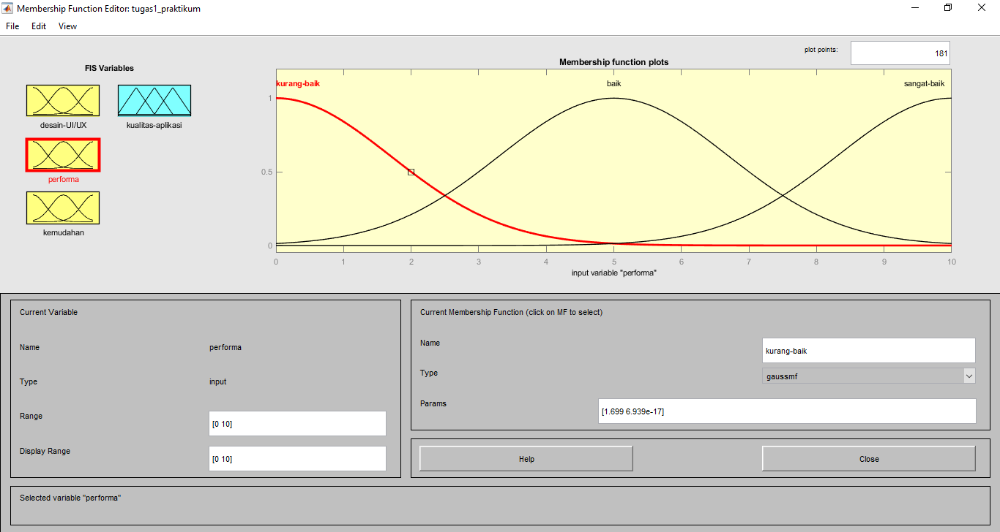
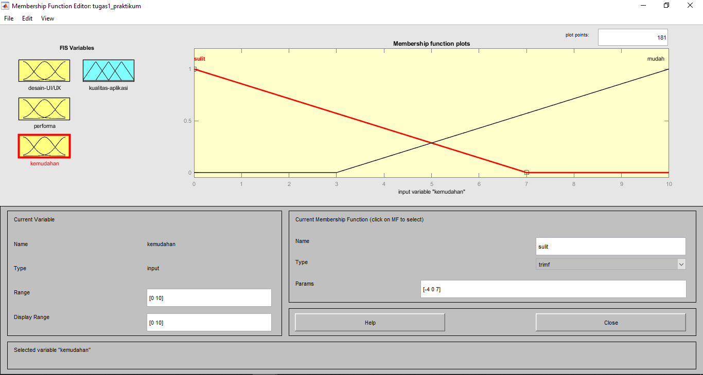
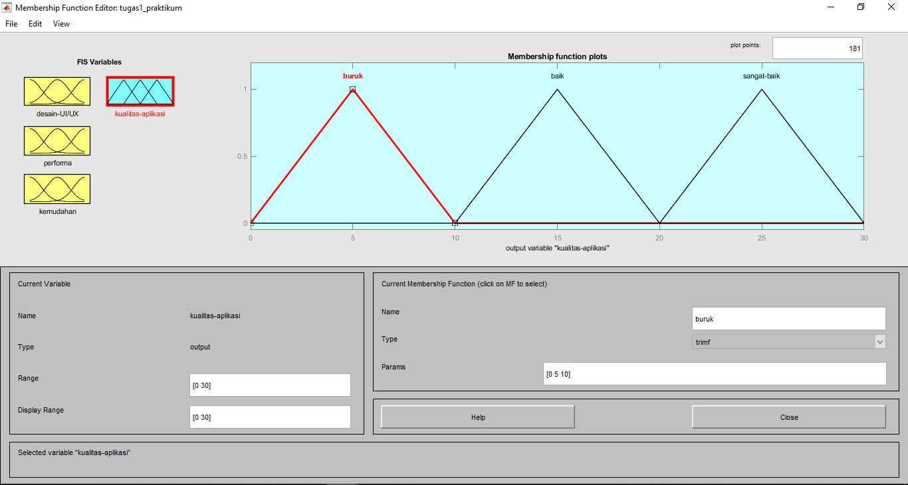
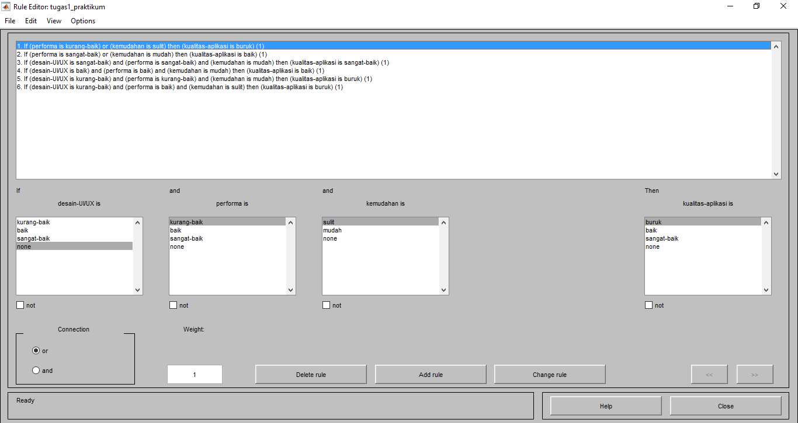
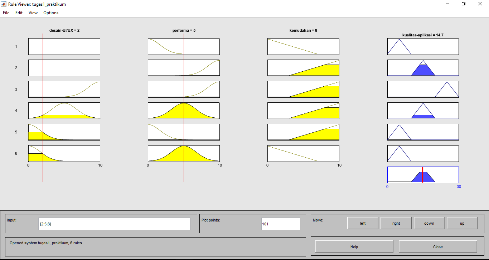
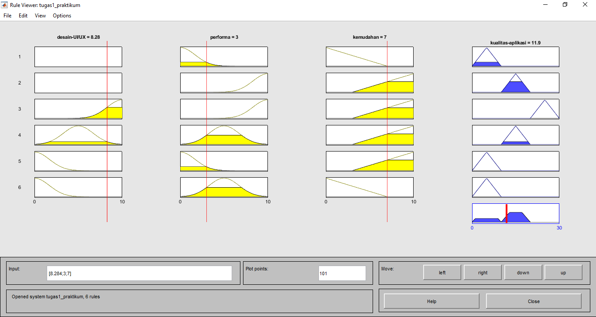
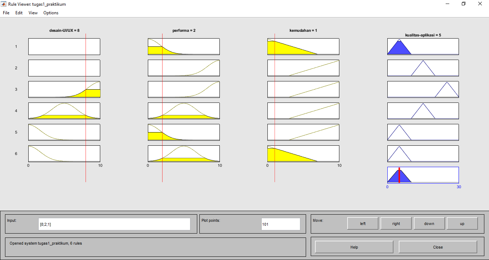
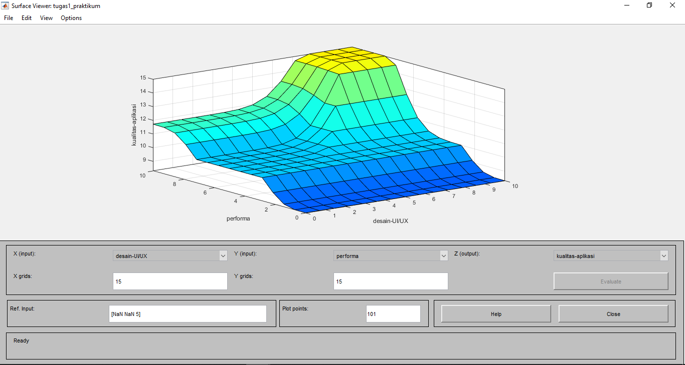

## Fuzzy Logic Design

 

## Desain UI/UX Function

 

## Performa Function

 

## Kemudahan Function

 

## Kualitas Aplikasi Function

 

## Rule Editor

 

## Rule Views

 

## Surface

